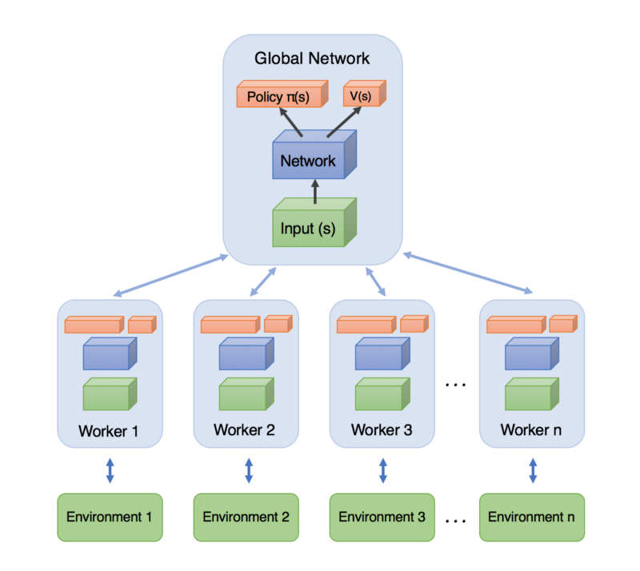

# Reinforcement Learning with LSTM using A3C Algorithm

This project leverages PyTorch, OpenAI Gym, and Universe to implement Long Short Term Memory (LSTM) in reinforcement learning, specifically Google DeepMind's Asynchronous Advantage Actor-Critic (A3C) algorithm.

## Environment

The implementation is demonstrated in an IPython/Jupyter Notebook environment, with input changes made in the notebook.

## Asynchronous Advantage Actor-Critic (A3C)

A3C is an algorithm introduced by Google DeepMind in their paper titled "Asynchronous Methods for Deep Reinforcement Learning." It's a powerful approach that obsoletes Deep Q Networks (DQN) and works effectively in both continuous and discrete action spaces.

### Key Features

- Faster, simpler, and more robust than DQN.
- Achieves better scores on a variety of Deep RL tasks.
- Suitable for complex state and action spaces.

## Actor-Critic Structure

The A3C algorithm follows an Actor-Critic structure where an actor predicts actions, and a critic evaluates these actions.

## Training Process

The training process involves many workers training and learning concurrently. They then update the global network with gradients, as illustrated below:

## Long Short Term Memory (LSTM)

LSTM recurrent neural networks are implemented using PyTorch. You can learn more about LSTM [here](http://colah.github.io/posts/2015-08-Understanding-LSTMs/).

## Trained Models

Trained models are generated during a full training episode. Continuously running the model will update it with new training data. A parameter `L` (Load) can be set to `True` to continue training from a saved checkpoint.

## Optimizers and Shared Optimizers/Statistics

This implementation supports RMSProp and Adaptive Moment Estimation (Adam) optimizers. RMSProp divides the learning rate by an exponentially decaying average of squared gradients, while Adam computes adaptive learning rates for each parameter. 

## Training Considerations

To achieve efficient training, it's important to limit the number of worker threads to the number of CPU cores available on your machine. Using more worker threads than available CPU cores can result in poor performance and inefficiency.

The original implementation and data credits go to their respective authors. This information is presented here for personal understanding and educational purposes.
